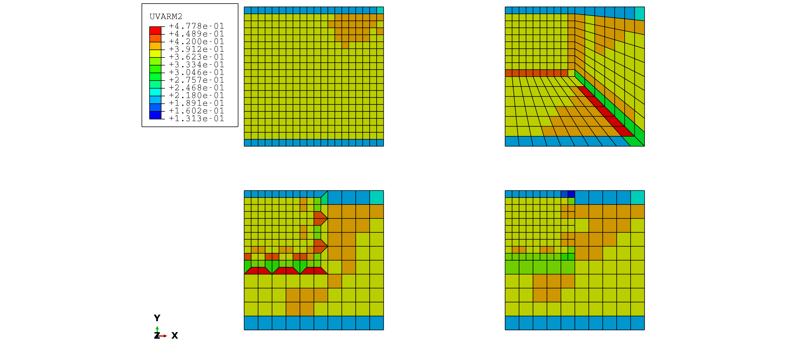

# Hydrostatic stress gradient estimation for different mesh refiment strategies

The pourpose of these tests is to verify the accuracy of the stress
gradient estimation in presence of a non uniform mesh. These examples are
discussed in

> **G. Gobbi, C. Colombo, S. Miccoli, L. Vergani (2018)**. A
> fully coupled implementation of hydrogen embrittlement in FE
> analysis. To be submitted.

## Files

### Abaqus job files:

- `bend_uniform.inp` uniform mesh refinement
- `bend_diagonal.inp` diagonal partition
- `bend_trapezoidal.inp` trapezoidal elements at transition
- `bend_mpc.inp` MPC (multi point constraints) at transition
- `hydra.f`: user subroutine for hydrostratic stress gradient estimation
- `hydra.inc`: user subroutine include file

### Hydra generated files:

- `bend_*.jac`: auxiliary files for the computation of the inverse jacobian
  matrix

## Run instructions.

Here instructions for running `bend_uniform`, analogous instructions
hold for the other files.

1. Generate the inverse Jacobian map

        $ abaqus datacheck j=bend_uniform
        $ abaqus python ../../abapython/mkjac.py bend_uniform

   These commands will create `bend_uniform.jac`, which will be read by user
   subroutine `hydra.f`

1. Run the analysis

        $ abaqus continue user=hydra.f j=bend_uniform

1. Repeat the above instructions for `bend_diagonal`, `bend_trapezoidal`,
   `bend_mpc`.

### Results

The hydrostic stress gradient components will be saved in `UVARM1`
(x-component) and `UVARM2` (y-component).

Hydrostratic stress gradient, (y-component) for all mesh refinement
strategies:

For reference the computed `*.jac` files are stored in subfolder
[results](results).
